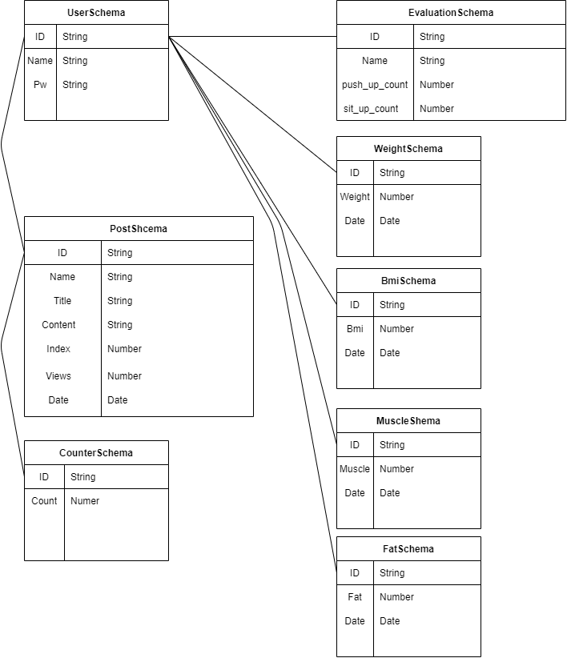

# Db Schema 설명

## UserSchema
사용자의 정보를 관리하는 스키마입니다.
로그인, 회원가입, 게시판, 데이터 조회등에 사용됩니다.

## EvaluationSchema
사용자의 팔굽혀펴기 및 윗몸일으키기 횟수를 관리하는 스키마입니다. 
횟수 측정 기능과 횟수 조회 기능에서 사용됩니다.

## Weight,Fat,Bmi,Muscle,Fat Schema
사용자의 InBody 정보를 관리하는 스키마입니다.
InBody 데이터 조회 및 추가 기능에서 사용됩니다.

## PostSchema
게시글을 관리하는 스키마입니다. 게시판 조회 및 추가 기능에서 사용됩니다.

## CounterSchema
게시글의 조회수 연산을 돕는 스키마입니다. 게시판 조회 기능에서 사용됩니다.
