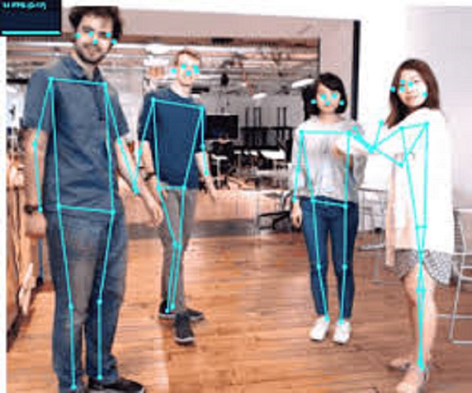
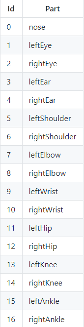

# 포즈 검출 및 표시 기능 설명

## 1.포즈 검출
사용자로부터 우선 영상데이터(Video 혹은 LiveCamera)를 받아온다. 이를 Tensorflow의 포즈 추정 알고리즘인 Posenet 모델에 입력한다. Posenet는 입력값을 기반으로 몸에서 17개의 포즈 데이터를 검출해낸다. 추출되는 값은 다음과 같다.

## 2.포즈 그리기
추출된 포즈 데이터를 기반으로 P5 라이브러리를 사용하여 화면에 포즈데이터를 점으로 그려준다. p5을 이용하여 Canva를 생성한다. sketch & draw기능을 이용하여 받아온 Pose데이터를 화면에 그려주게 된다.

## 3.뼈대 그리기
포즈 데이터에서 추출된 스켈레톤 데이터의 x,y 좌표값과 p5 sketch를 이용하여 최종적으로 뼈대를 그릴 수 있게 된다.

