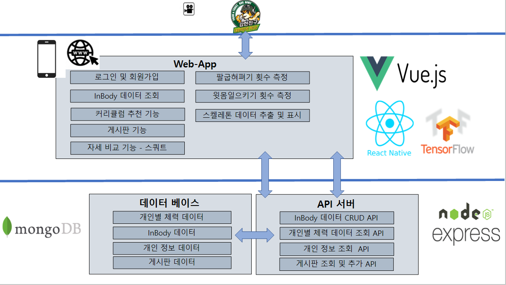
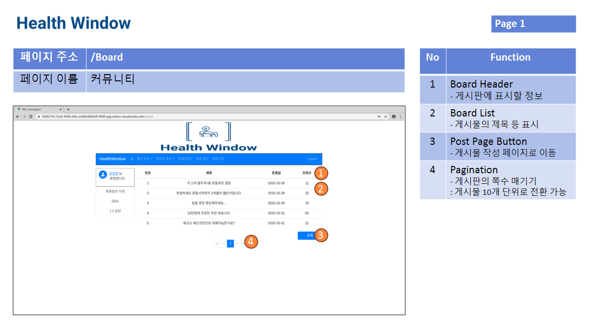

# Health Window - 헬스케어솔루션


## 프로젝트 소개 
저희 Healthcare 는 군 내에서 운동하는 장병들에게 도움을 주고자 만들어진 웹-앱 어플리케이션입니다. 운동을 처음 시작하여 타인에게 도움을 받고싶은사람, 운동을 하면서 자신의 체성분 변화를 기록하고, 운동내용을 공유하고싶은사람 모두에게 도움을 줍니다.

또한 장병들의 병 자격 인증평가에 반영되는 팔굽혀펴기, 윗몸일으키기 횟수를 저장하여 관리자는 병사들의 기록을 한눈에 알아볼수 있습니다. Healthcare는 운동하는 많은 장병들이 운동관련하여 소통하며, 건강하게 운동할 수 있는 커넥션이 되었으면 좋겠습니다.

## 시연 영상
[](https://youtu.be/nTpdAnm6aWc)

## 프로젝트 소개(Project Information)

react-native 와 vue를 이용하여 Web-App 형식의 어플리케이션을 개발하였습니다.

사용자의 자세를 인식하여 병기본시 체력 측정에 도움을 줍니다. 운동 자세를 특급용사의 자세와 비교하여 헬스활동에도 도움을 줍니다.

모든 기능은 웹 및 앱에서도 지원됩니다.

### 횟수 측정 (팔굽혀펴기, 윗몸일으키기)
   [   보러가기 ](./data/count.md "횟수측정 보러가기")

<br>
<br>

#### 점수 측정  
  

### 기술 문서
---
- [포즈 검출 및 표시기능 설명](pose_parse_view.md)
- [팔굽혀펴기 관련 문서](push_up_count.md)
- [윗몸일으키기 관련 문서](sit_up_count.md)
- [자세교정 관련 문서](pose_compare.md)

## 기능 소개

### 웹 페이지 기본 구성 

[★웹 페이지 설명(클릭)](./data/pageInt.pdf "웹 페이지 설명")


일반유저 => 회원가입후 사용 <br>
   관리자   => ID,pw: root

    홈 -> 페이지 설명
    헬스차트 -> 인바디 기록 저장
    전투력 측정 -> 팔굽혀펴기, 윗몸일으키기 영상을 이용하여 갯수를 측정하고, 관리자에게 전송
    전투력 측정(관리자) -> 관리자의 경우 저장된 모든 인원들의 팔굽혀펴기, 윗몸일으키기 갯수를 표를 이용하여 표시
    자세교정 -> 첨부된 영상을 이용하여 올바른 자세와 비교하여 점수를 평가
    운동추천 -> 다양한 운동들을 알려주기 위한 운동추천 페이지
    커뮤니티 -> 여러 사람들끼리 운동 관련하여 의사소통하여 운동관련 지식 공유하는 페이지

### DB 설계

- [DB 스키마설명](db_schema.md)

## 기술 스택 (Technique Used) 

### Frontend
<table>
    <tr>
        <td align="center"></td>
        <td align="center"></td>
        <td align="center"></td>
        <td align="center"></td>
    </tr>
    <tr>
        <td align="center">react-native</td>
        <td align="center">p5</td>
        <td align="center">ml5+tensorflow</td>
        <td align="center">Vue</td>
        </tr>
</table>

### Backend
<table>
    <tr>
        <td align="center"></td>
        <td align="center"></td>
        <td align="center"></td>
        <td align="center"></td>
    </tr>
    <tr>
        <td align="center">nodejs</td>
        <td align="center">node Express</td>
        <td align="center">mongodb</td>
        <td align="center">mongoose</td>
        </tr>
</table>

## 설치 안내 (Installation Process)
##### 파일 내려받기
```bash
$ git clone git주소
```
##### 데이터베이스 실행(mongodb)
```bash
$ mongod
```

##### 백엔드 서버 활성화 (다른 터미널에서 실행)
```bash
$ cd WEB_HealthWindow_APAD/backend
$ npm install
$ node app
```
 
## 팀 정보 (Team Information)
- 이상엽 (mma7710@naver.com), Github Id: pp449
- 정현태 (kathor888@naver.com) Github Id: kathor888@gmail.com
- 유호연 (rhkdwk1905@naver.com), Github Id: rhkdwk1905

## 저작권 및 사용권 정보 (Copyleft / End User License)
 * [MIT](https://github.com/osam2020-WEB/Sample-ProjectName-TeamName/blob/master/license.md)
