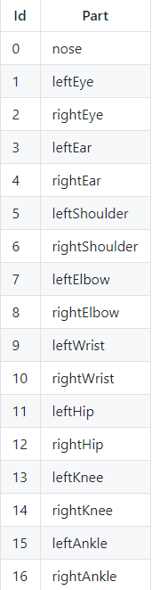

# 윗몸일으키기 횟수 기능 설명
 

## 입력 데이터 값
사용자로부터 우선 영상데이터(Video 혹은 LiveCamera)를 받아온다. 이를 Tensorflow의 포즈 추정 알고리즘인 Posenet 모델에 입력한다. Posenet는 입력값을 기반으로 몸에서 17개의 포즈 데이터를 검출해낸다. 추출되는 값은 다음과 같다.
데이터는 영상데이터이므로 프레임당 추출된 Pose배열의 값들이 결과값이 된다.

## 횟수 세기

윗몸일으키기의 경우 사용자의 머리 와 발목,무릎 잘 보이는 측면에서 촬영할 시 pose데이터의 정확성이 높았다. 윗몸일으키기시 가장 정적인 발목,무릎과 가장 동적인 머리부분의 좌표데이터를 매프레임마다 비교한다. 이를 통해 머리 부분의 좌표값이 윗몸일으키기의 가동범위를 충족할때마다 횟수가 +1 되도록 알고리즘을 만들었다.

